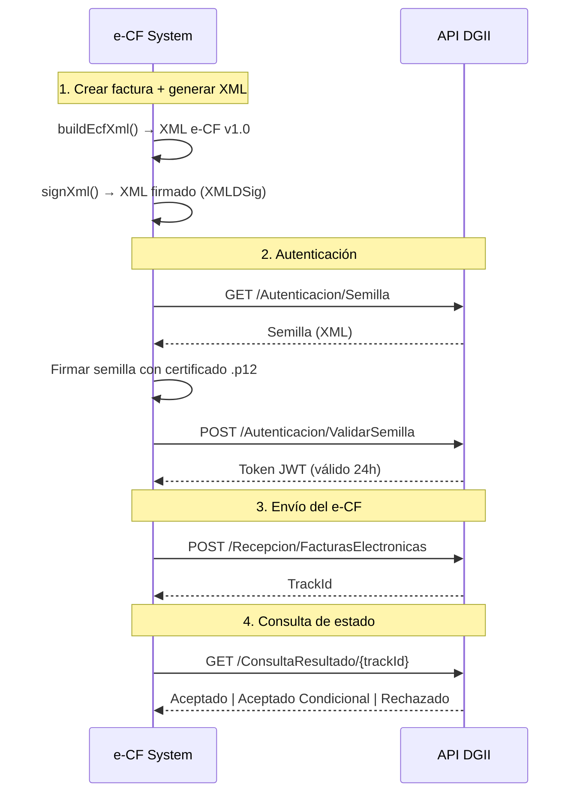

<p align="center">
  
  
  
  
  
</p>

<h1 align="center">🧾 e-CF DGII System</h1>

<p align="center">
  <strong>Sistema de Facturación Electrónica — Comprobantes Fiscales Electrónicos (e-CF)</strong><br/>
  Plataforma integral para la emisión, firma digital y gestión de comprobantes fiscales electrónicos<br/>
  conforme a las normativas de la <strong>Dirección General de Impuestos Internos (DGII)</strong> de República Dominicana.
</p>

<p align="center">
  <a href="#-características">Características</a> •
  <a href="#️-arquitectura">Arquitectura</a> •
  <a href="#-inicio-rápido">Inicio Rápido</a> •
  <a href="#-api-reference">API Reference</a> •
  <a href="#-módulos-del-sistema">Módulos</a> •
  <a href="#-estructura-del-proyecto">Estructura</a>
</p>

---

## 📋 Descripción

**e-CF DGII System** es una solución completa para la gestión de comprobantes fiscales electrónicos en República Dominicana. El sistema permite generar, firmar digitalmente y transmitir facturas electrónicas a la DGII siguiendo la especificación **e-CF v1.0**, cumpliendo con todos los requisitos técnicos establecidos por la normativa vigente.

El sistema soporta los cuatro tipos principales de comprobantes fiscales electrónicos:

| Código | Tipo | Descripción |
|:------:|------|-------------|
| **31** | Factura de Crédito Fiscal Electrónica (FCF) | Para transacciones entre contribuyentes |
| **32** | Factura de Consumo Electrónica (FC) | Para ventas a consumidores finales |
| **33** | Nota de Débito Electrónica (ND) | Para ajustes de montos a favor del emisor |
| **34** | Nota de Crédito Electrónica (NC) | Para ajustes de montos a favor del comprador |

---

## ✨ Características

### Gestión de Facturas
- ✅ Creación de facturas electrónicas con cálculo automático de ITBIS (18% y 16%)
- ✅ Generación automática de e-NCF (Número de Comprobante Fiscal Electrónico)
- ✅ Soporte para descuentos por línea y múltiples formas de pago
- ✅ Manejo de notas de crédito y débito con referencia a e-NCF original
- ✅ Eliminación segura (solo facturas en borrador o creadas)

### Generación de XML
- ✅ Construcción de XML conforme a la especificación DGII e-CF v1.0 (`urn:dgii:ecf:2019`)
- ✅ Inclusión de datos de Encabezado, Emisor, Comprador, Totales, DetallesItems
- ✅ Manejo de InformacionReferencia para NC/ND
- ✅ Formato estándar con canonicalización XML

### Firma Digital
- ✅ Firma XML Digital Signature (XMLDSig) con algoritmo RSA-SHA256
- ✅ Soporte para certificados `.p12` / PKCS#12
- ✅ Modo demo para desarrollo sin certificado real
- ✅ Integración de `SignedInfo`, `SignatureValue`, `KeyInfo` y `X509Data`

### Integración DGII
- ✅ Autenticación con semilla firmada (flujo Seed → Token)
- ✅ Envío de e-CF firmados al endpoint de Recepción
- ✅ Consulta de estado de comprobantes enviados (TrackId)
- ✅ Soporte para entornos **TesteCF** (pruebas) y **Producción**
- ✅ Modo simulado para desarrollo sin conexión a DGII

### Gestión de Clientes
- ✅ CRUD completo de clientes/compradores
- ✅ Búsqueda por RNC/Cédula o Razón Social
- ✅ Validación de RNC/Cédula único
- ✅ Eliminación lógica (soft delete)

### Configuración
- ✅ Datos del emisor (RNC, Razón Social, dirección, contacto)
- ✅ Gestión de secuencias e-NCF autorizadas por la DGII
- ✅ Monitoreo de uso de secuencias con barras de progreso
- ✅ Selección de entorno (TesteCF / Producción)

### Interfaz de Usuario
- ✅ Dashboard con estadísticas en tiempo real y facturas recientes
- ✅ Diseño premium con tema oscuro (glassmorphism, gradientes, micro-animaciones)
- ✅ Navegación SPA con React Router
- ✅ Notificaciones toast para feedback de acciones
- ✅ Modales para creación rápida de clientes
- ✅ Visualización directa de XML generado
- ✅ Diseño responsivo

---

## 🏗️ Arquitectura

```
┌─────────────────────────────────────────────────────┐
│                    FRONTEND                         │
│              React + Vite (:5173)                   │
│                                                     │
│  ┌──────────┐ ┌──────────┐ ┌──────────┐            │
│  │Dashboard │ │Facturas  │ │Clientes  │  ...        │
│  └──────────┘ └──────────┘ └──────────┘            │
│         │           │            │                   │
│         └───────────┼────────────┘                   │
│                     │                                │
│              Axios API Client                        │
│                  /api/*                              │
└─────────────────────┬───────────────────────────────┘
                      │  HTTP (Vite Proxy)
┌─────────────────────┴───────────────────────────────┐
│                    BACKEND                          │
│              NestJS + TypeScript (:3000)             │
│                                                     │
│  ┌──────────────┐ ┌──────────────┐ ┌─────────────┐ │
│  │FacturasModule│ │ClientesModule│ │ConfigModule  │ │
│  │  Controller  │ │  Controller  │ │  Controller  │ │
│  │  Service     │ │  Service     │ │  Service     │ │
│  └──────┬───────┘ └──────┬───────┘ └──────┬──────┘ │
│         │                │                │         │
│  ┌──────┴────────────────┴────────────────┴──────┐  │
│  │           DatabaseService (Global)            │  │
│  │               sql.js (SQLite)                 │  │
│  └───────────────────────────────────────────────┘  │
│                                                     │
│  ┌─────────────────┐  ┌──────────────────────────┐  │
│  │    EcfModule     │  │      DgiiModule          │  │
│  │ SequenceManager  │  │    DgiiApiService        │  │
│  │ XmlBuilder       │  │  (Auth, Send, Track)     │  │
│  │ Signer           │  │                          │  │
│  └─────────────────┘  └──────────────────────────┘  │
└─────────────────────────────────────────────────────┘
                      │
              ┌───────┴───────┐
              │   data/ecf.db │
              │   (SQLite)    │
              └───────────────┘
```

---

## 🚀 Inicio Rápido

### Prerrequisitos

- **Node.js** 18 o superior
- **npm** 9 o superior

### Instalación

```bash
# Clonar el repositorio
git clone https://github.com/tu-usuario/dgii-system.git
cd dgii-system

# Instalar dependencias del backend
cd backend
npm install

# Instalar dependencias del frontend
cd ../frontend
npm install
```

### Ejecución en Desarrollo

Abre dos terminales:

```bash
# Terminal 1 — Backend (NestJS)
cd backend
npm run dev
# ✅ API corriendo en http://localhost:3000
```

```bash
# Terminal 2 — Frontend (React + Vite)
cd frontend
npm run dev
# ✅ UI corriendo en http://localhost:5173
```

> 💡 El frontend tiene un proxy configurado que redirige las peticiones `/api/*` al backend en el puerto 3000 automáticamente.

### Build para Producción

```bash
# Backend
cd backend
npm run build
npm run start:prod

# Frontend
cd frontend
npm run build
# Los archivos estáticos se generan en frontend/dist/
```

---

## 📡 API Reference

Todas las rutas tienen el prefijo `/api`.

### Facturas

| Método | Endpoint | Descripción | Parámetros |
|--------|----------|-------------|------------|
| `GET` | `/api/facturas/stats/dashboard` | Estadísticas del dashboard | — |
| `GET` | `/api/facturas` | Listar facturas | `?estado=creada&tipo_ecf=31&page=1&limit=50` |
| `GET` | `/api/facturas/:id` | Obtener factura por ID | — |
| `POST` | `/api/facturas` | Crear nueva factura | Body JSON (ver abajo) |
| `POST` | `/api/facturas/:id/enviar` | Enviar factura a la DGII | — |
| `POST` | `/api/facturas/:id/consultar` | Consultar estado en DGII | — |
| `DELETE` | `/api/facturas/:id` | Eliminar factura | Solo borradores/creadas |

<details>
<summary><strong>📄 Body para crear factura</strong></summary>

```json
{
  "tipo_ecf": 31,
  "cliente_id": 1,
  "tipo_pago": 1,
  "fecha_vencimiento": "2026-04-14",
  "notas": "Factura de ejemplo",
  "referencia_encf": "",
  "items": [
    {
      "descripcion": "Servicio de consultoría",
      "cantidad": 10,
      "unidad_medida": "HRS",
      "precio_unitario": 2500.00,
      "tasa_itbis": 18,
      "descuento_porcentaje": 0
    }
  ]
}
```
</details>

<details>
<summary><strong>📄 Respuesta del Dashboard</strong></summary>

```json
{
  "total": 15,
  "creadas": 5,
  "enviadas": 8,
  "aceptadas": 6,
  "rechazadas": 1,
  "montoTotal": 1250000.00,
  "montoMes": 350000.00,
  "recientes": [
    {
      "id": 15,
      "encf": "E310000000015",
      "tipo_ecf": 31,
      "monto_total": 29500.00,
      "estado": "creada",
      "estado_dgii": "pendiente",
      "fecha_emision": "2026-03-14",
      "cliente_nombre": "Empresa Ejemplo SRL"
    }
  ]
}
```
</details>

### Clientes

| Método | Endpoint | Descripción | Parámetros |
|--------|----------|-------------|------------|
| `GET` | `/api/clientes` | Listar clientes | `?search=texto&page=1&limit=50` |
| `GET` | `/api/clientes/:id` | Obtener cliente por ID | — |
| `POST` | `/api/clientes` | Crear cliente | Body JSON |
| `PUT` | `/api/clientes/:id` | Actualizar cliente | Body JSON |
| `DELETE` | `/api/clientes/:id` | Eliminar cliente (soft) | — |

<details>
<summary><strong>📄 Body para crear/actualizar cliente</strong></summary>

```json
{
  "rnc_cedula": "101010101",
  "razon_social": "Mi Empresa SRL",
  "nombre_comercial": "Mi Empresa",
  "direccion": "Av. Winston Churchill #100",
  "municipio": "Santo Domingo de Guzmán",
  "provincia": "Distrito Nacional",
  "telefono": "809-555-0100",
  "correo": "info@miempresa.com",
  "tipo_identificacion": 1
}
```
</details>

### Configuración

| Método | Endpoint | Descripción |
|--------|----------|-------------|
| `GET` | `/api/configuracion` | Obtener configuración y secuencias |
| `PUT` | `/api/configuracion` | Actualizar datos del emisor |
| `PUT` | `/api/configuracion/secuencias/:tipo` | Actualizar rango de secuencia e-NCF |

---

## 📦 Módulos del Sistema

### Backend — NestJS

| Módulo | Archivos | Responsabilidad |
|--------|----------|-----------------|
| **DatabaseModule** | `database.service.ts` | Conexión sql.js, inicialización de tablas, seeding, helpers de consulta. Módulo **global** inyectable en toda la app. |
| **EcfModule** | `sequence-manager.service.ts`, `xml-builder.service.ts`, `signer.service.ts` | Generación de e-NCF, construcción de XML DGII v1.0, firma digital XMLDSig RSA-SHA256. |
| **DgiiModule** | `dgii-api.service.ts` | Cliente HTTP para la API de la DGII: autenticación por semilla, envío de e-CF, consulta de estado. Modo simulado para desarrollo. |
| **FacturasModule** | `facturas.controller.ts`, `facturas.service.ts` | CRUD de facturas, cálculo de ITBIS, generación automática de XML al crear, integración con DGII. |
| **ClientesModule** | `clientes.controller.ts`, `clientes.service.ts` | CRUD de clientes con búsqueda, validación de duplicados, y soft delete. |
| **ConfiguracionModule** | `configuracion.controller.ts`, `configuracion.service.ts` | Gestión de datos del emisor y rangos de secuencias e-NCF. |

### Frontend — React

| Componente | Archivo | Descripción |
|------------|---------|-------------|
| **Sidebar** | `components/Sidebar.jsx` | Navegación lateral con NavLink y SVG icons |
| **Modal** | `components/Modal.jsx` | Modal reutilizable con overlay |
| **ToastContainer** | `components/ToastContainer.jsx` | Notificaciones toast animadas |
| **Dashboard** | `pages/Dashboard.jsx` | Stats grid + tabla de facturas recientes |
| **NuevaFactura** | `pages/NuevaFactura.jsx` | Formulario de creación con ítems dinámicos y cálculos en tiempo real |
| **Facturas** | `pages/Facturas.jsx` | Lista con filtros, acciones DGII, XML preview |
| **Clientes** | `pages/Clientes.jsx` | Grid de tarjetas, búsqueda, CRUD con modales |
| **Configuracion** | `pages/Configuracion.jsx` | Formulario de emisor + cards de secuencias |

---

## 📁 Estructura del Proyecto

```
dgii-system/
│
├── backend/                          # API — NestJS + TypeScript
│   ├── src/
│   │   ├── main.ts                   # Bootstrap, CORS, /api prefix
│   │   ├── app.module.ts             # Root module
│   │   │
│   │   ├── database/
│   │   │   ├── database.module.ts    # Global module
│   │   │   └── database.service.ts   # sql.js, tables, seeding, queries
│   │   │
│   │   ├── ecf/
│   │   │   ├── ecf.module.ts
│   │   │   ├── sequence-manager.service.ts   # e-NCF generation
│   │   │   ├── xml-builder.service.ts        # e-CF XML v1.0
│   │   │   └── signer.service.ts             # XMLDSig RSA-SHA256
│   │   │
│   │   ├── dgii/
│   │   │   ├── dgii.module.ts
│   │   │   └── dgii-api.service.ts   # DGII API client
│   │   │
│   │   ├── facturas/
│   │   │   ├── facturas.module.ts
│   │   │   ├── facturas.controller.ts
│   │   │   └── facturas.service.ts
│   │   │
│   │   ├── clientes/
│   │   │   ├── clientes.module.ts
│   │   │   ├── clientes.controller.ts
│   │   │   └── clientes.service.ts
│   │   │
│   │   └── configuracion/
│   │       ├── configuracion.module.ts
│   │       ├── configuracion.controller.ts
│   │       └── configuracion.service.ts
│   │
│   ├── package.json
│   ├── tsconfig.json
│   ├── tsconfig.build.json
│   └── nest-cli.json
│
├── frontend/                         # UI — React + Vite
│   ├── src/
│   │   ├── main.jsx                  # React entry + BrowserRouter
│   │   ├── App.jsx                   # Layout + Routes + ToastContext
│   │   ├── index.css                 # Premium dark theme
│   │   │
│   │   ├── components/
│   │   │   ├── Sidebar.jsx
│   │   │   ├── Modal.jsx
│   │   │   └── ToastContainer.jsx
│   │   │
│   │   ├── pages/
│   │   │   ├── Dashboard.jsx
│   │   │   ├── NuevaFactura.jsx
│   │   │   ├── Facturas.jsx
│   │   │   ├── Clientes.jsx
│   │   │   └── Configuracion.jsx
│   │   │
│   │   ├── services/
│   │   │   └── api.js                # Axios client
│   │   │
│   │   ├── hooks/
│   │   │   └── useToast.js
│   │   │
│   │   └── utils/
│   │       └── helpers.js            # formatMoney, formatDate, badges
│   │
│   ├── vite.config.js                # Dev proxy /api → :3000
│   ├── index.html
│   └── package.json
│
├── data/
│   └── ecf.db                        # SQLite database
│
├── .gitignore
└── README.md
```

---

## 🗄️ Base de Datos

El sistema utiliza **SQLite** (vía sql.js) con las siguientes tablas:

```sql
-- Datos del emisor (empresa)
configuracion (id, rnc, razon_social, nombre_comercial, direccion,
               municipio, provincia, telefono, correo, website,
               actividad_economica, ambiente, fecha_creacion)

-- Clientes / Compradores
clientes (id, rnc_cedula, razon_social, nombre_comercial, direccion,
          municipio, provincia, telefono, correo, tipo_identificacion,
          activo, fecha_creacion)

-- Secuencias de numeración e-NCF
secuencias_ecf (id, tipo_ecf, serie, secuencia_desde, secuencia_hasta,
                secuencia_actual, estado, fecha_autorizacion)

-- Facturas / Comprobantes
facturas (id, encf, tipo_ecf, tipo_ingreso, tipo_pago, cliente_id,
          fecha_emision, fecha_vencimiento, subtotal, total_descuento,
          monto_gravado_18, monto_gravado_16, monto_exento,
          itbis_18, itbis_16, itbis_total, monto_total,
          estado, estado_dgii, trackid_dgii, mensaje_dgii,
          xml_generado, xml_firmado, notas, referencia_encf,
          fecha_creacion, fecha_envio_dgii)

-- Detalle de ítems por factura
detalle_factura (id, factura_id, linea, descripcion, cantidad,
                 unidad_medida, precio_unitario, descuento_porcentaje,
                 descuento_monto, tasa_itbis, itbis_monto,
                 monto_total, codigo_item)
```

---

## 🔐 Flujo de Firma Digital y Envío a DGII



---

## 🔧 Scripts Disponibles

### Backend (`cd backend`)

| Script | Comando | Descripción |
|--------|---------|-------------|
| `dev` | `npm run dev` | Inicia en modo watch (desarrollo) |
| `build` | `npm run build` | Compila TypeScript a JavaScript |
| `start` | `npm run start` | Inicia sin watch |
| `start:prod` | `npm run start:prod` | Inicia desde `dist/` (producción) |
| `start:debug` | `npm run start:debug` | Inicia con debugger |

### Frontend (`cd frontend`)

| Script | Comando | Descripción |
|--------|---------|-------------|
| `dev` | `npm run dev` | Servidor de desarrollo Vite |
| `build` | `npm run build` | Build de producción |
| `preview` | `npm run preview` | Preview del build de producción |

---

## 🛠️ Stack Tecnológico

| Capa | Tecnología | Versión |
|------|-----------|---------|
| **Backend Framework** | NestJS | 11.x |
| **Lenguaje Backend** | TypeScript | 5.x |
| **Frontend Framework** | React | 19.x |
| **Bundler** | Vite | 8.x |
| **Base de Datos** | SQLite (sql.js) | — |
| **HTTP Client** | Axios | 1.x |
| **XML Builder** | xmlbuilder2 | 3.x |
| **Criptografía** | node-forge + crypto | — |
| **Routing** | React Router DOM | 7.x |

---

## 📌 Variables de Entorno

| Variable | Default | Descripción |
|----------|---------|-------------|
| `PORT` | `3000` | Puerto del backend NestJS |

---

## 📜 Licencia

Este proyecto es de uso privado. Todos los derechos reservados.

---

<p align="center">
  <strong>Hecho con ❤️ para República Dominicana 🇩🇴</strong><br/>
  Sistema de Facturación Electrónica conforme a la normativa DGII
</p>
